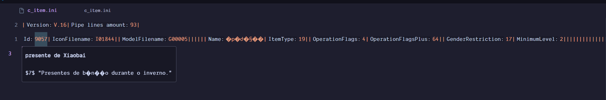
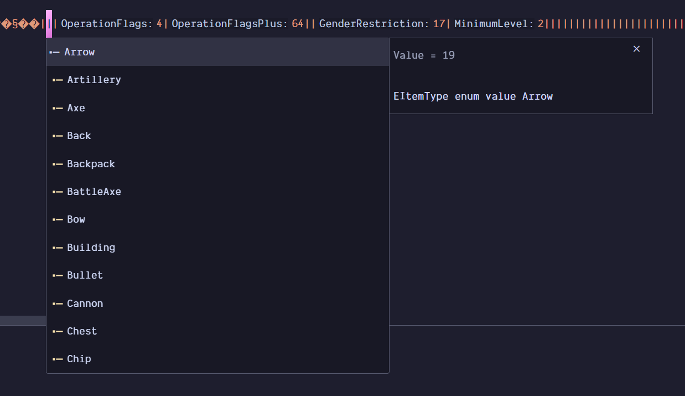

# GFE INI Language Server

**Advanced language support for `.ini` files used in GFE/GFO projects.**

This extension provides enhanced editing features for custom `.ini` configuration files such as `c_item.ini`, including:

- ✅ Inlay Hints (field names for better readability)
- ✅ Hover tooltips with field descriptions
- ✅ Autocompletion (context-aware)
- ✅ Lightweight and fast
- ✅ Designed specifically for MMO modding data formats

---

## 🚀 Features

- **Inlay Hints**: See contextual labels above field values for easier understanding.
- **Hover Information**: Get field documentation by hovering over values.
- **Completion Items**: Intelligent suggestions based on the field position.
- **File-based Handlers**: Support for multiple `.ini` file formats (e.g., `c_item.ini`, `c_npc.ini`).

---

## 🧠 Supported File Types

- `c_item.ini`
- (more coming soon...)

---

## 📦 Installation

You can install this extension from the [Visual Studio Marketplace](https://marketplace.visualstudio.com/).
